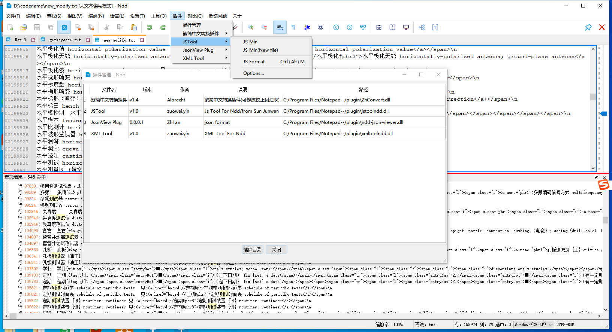
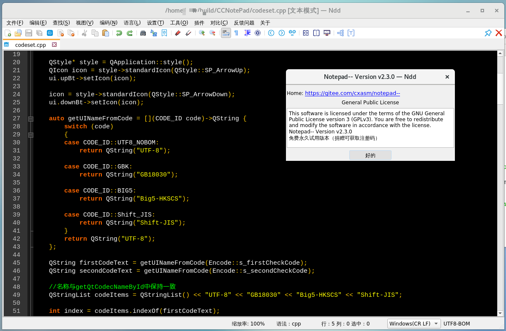

# notepad--

[中文 ](README.md) | [English](README_EN.md)

## 项目简介

Notepad--是一个使用C++编写的文本编辑器，可以支持Win/Linux/Mac平台。

我们的目标是提供一个国产的可替代的文本编辑类软件，优先在国产Uos、Linux系统、Mac系统上发展。

对比其它竞品文本编辑类软件，我们的优势是可以跨平台，支持Windows/Linux/Mac操作系统。

 **鉴于某些文本编辑软件竞品作者的不当言论，Notepad--的意义在于：减少一点错误言论，减少一点自以为是。** 

 **Notepad--的目标是致力于国产软件的可替代，专心做软件。**

您可以在这个项目提交bug或反馈问题。

最新版本下载地址：https://gitee.com/cxasm/notepad--/releases/latest

NDD 具备插件编写功能，希望广大的CPP/QT开发者加入我们，插件功能均可以留上您的大名和捐赠渠道，希望
开发者参与插件功能开发。

做国人自己的免费编辑器，离不开您的支持，请通过微信捐赠我们。

## 编译
见build目录下文档 linux开源编译及下载说明.txt

## 联络方式

QQ群：372613546 959439826(已满） 用户群，做NDD的问题反馈、功能建议等。

QQ群 616606091 开发群，建议懂CPP/QT、愿意参与NDD项目代码贡献的开发人士加入。

## 效果预览

 **windows效果图：** 

 **MacOS 效果图：** 

 **Redhat7.x 效果图：** 

